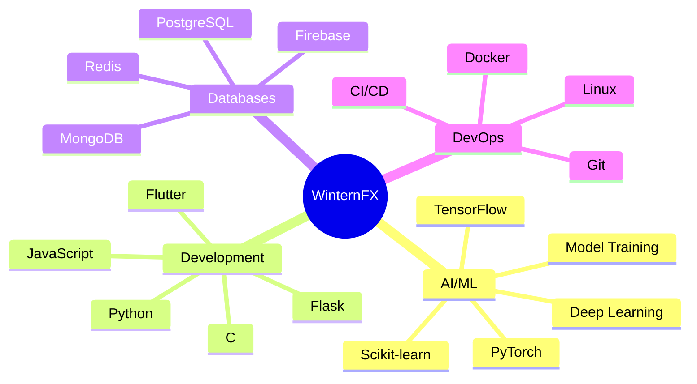

<div align="center">

#  Hi, I'm WinternFX


</div>


<div align="center">

```ascii
╔═══════════════════════════════════════════════════════════════╗
║  🌟 Crafting Intelligent Systems & Scalable Applications 🌟  ║
╚═══════════════════════════════════════════════════════════════╝
```

[](mailto:arjunashinodkvkl@gmail.com)
[](https://github.com/winternFX)


</div>

---


##  About Me

```python
#!/usr/bin/env python3

class WinternFX:
    def __init__(self):
        self.name = "WinternFX"
        self.role = "Full-Stack Developer | ML Enthusiast"
        self.language_spoken = ["Python", "C", "en_US"]
        self.contact = "arjunashinodkvkl@gmail.com"
        
    def current_status(self):
        return {
            "working_on": "🤖 AI-Powered Applications",
            "learning": "☁️ Cloud Architecture & MLOps",
            "hobbies": "🎮 Gaming | 🎵 Music | 💻 Open Source",
            "fun_fact": "🌙 I code better at night!"
        }
    
    def tech_stack(self):
        return {
            "languages": ["Python", "C", "JavaScript", "SQL"],
            "mobile": ["Flutter", "Dart"],
            "backend": ["Flask", "FastAPI"],
            "ai_ml": ["TensorFlow", "PyTorch", "Scikit-learn"],
            "databases": ["PostgreSQL", "Firebase", "MongoDB"],
            "tools": ["Git", "Docker", "Linux", "VS Code"]
        }

if __name__ == "__main__":
    dev = WinternFX()
    print("🚀 Let's build something amazing!")
```

<br clear="right"/>

---

##  Tech Arsenal

<div align="center">

### 💻 Languages & Frameworks


### 🤖 AI/ML & Data Science

<br/>


### 🗄️ Databases


### 🛠️ Tools & Platforms


</div>

---

<div align="center">

##  Connect With Me

[](mailto:arjunashinodkvkl@gmail.com)
[](https://github.com/winternFX)
[](https://linkedin.com/in/winternfx)
[](https://twitter.com/winternfx)
[](https://winternfx.dev)

</div>

---

## 🚀 What I'm Working On

<table>
<tr>
<td width="50%">

### 🤖 AI/ML Projects
- 🧠 Training custom ML models
- 🔍 Computer Vision applications
- 💬 NLP & Text Processing
- 📊 Data Analysis & Visualization
- 🎯 Model Deployment & MLOps

</td>
<td width="50%">

### 💻 Development
- 📱 Flutter mobile applications
- 🌐 Flask backend APIs
- 🗃️ Database architecture design
- ☁️ Cloud deployment solutions
- 🔧 Automation & scripting

</td>
</tr>
</table>

---

<div align="center">

## 📊 GitHub Statistics


</div>

---

<div align="center">

## 🏆 GitHub Trophies


</div>

---

## 💡 Skills Breakdown

<div align="center">



</div>

---

## 🎯 Current Focus

<div align="center">

| 🌱 Learning | 🚀 Building | 💡 Exploring |
|------------|------------|-------------|
| Advanced ML/DL | AI-powered apps | Cloud architecture |
| System Design | Scalable APIs | MLOps pipelines |
| Docker & K8s | Mobile apps | Open source |

</div>

---

<div align="center">

## 📈 Contribution Graph

[](https://github.com/winternFX)

</div>

---

<div align="center">

## 💬 Random Dev Quote


</div>

---

<div align="center">

### ⚡ Fun Facts

```javascript
const funFacts = {
    favoriteLanguage: "Python 🐍",
    codingStyle: "Clean, Documented, Efficient",
    workSetup: "Dual Monitors + Mechanical Keyboard ⌨️",
    coffeePerDay: "Too many to count ☕",
    motto: "Code. Build. Deploy. Repeat. 🚀"
};

console.log("Thanks for visiting! Let's connect and build something awesome! 🌟");
```

</div>

---

<div align="center">

## 🐍 Contribution Snake


</div>

---


<div align="center">

### 🌟 "First, solve the problem. Then, write the code." - John Johnson


**Made with 💜 and lots of ☕**

</div>
